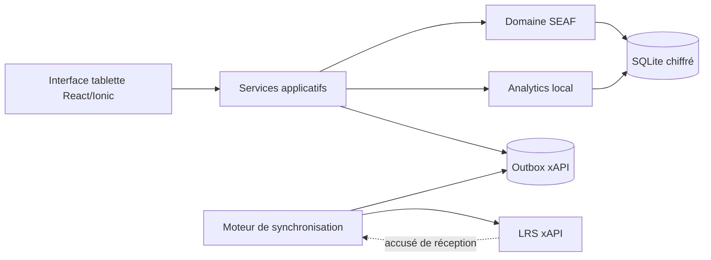

# 01 — Architecture proposée

## 1. Contexte

S.E.A.F. est une application d'évaluation pédagogique destinée à un usage terrain sur tablette. La contrainte principale est l'absence possible de réseau pendant une durée longue.

L'application doit donc être conçue **local-first / offline-first** : la base locale est la source opérationnelle de vérité pendant la séance. La synchronisation vers le LRS est une opération différée.

## 2. Choix d'architecture

### Choix retenu pour la proposition

**Application hybride installable : React + TypeScript + Ionic React + Capacitor 8.**

Le même code d'interface est utilisé pour une application web et pour une application native empaquetée. En production terrain, l'application est distribuée comme application installée sur tablette.

### Pourquoi ne pas retenir une simple PWA comme cible principale

Une PWA fonctionnerait hors-ligne grâce au Service Worker et à IndexedDB, mais elle dépend davantage du navigateur pour la persistance, le stockage sécurisé des secrets et le cycle de vie des données.

Pour des évaluations contenant des données nominatives, la cible native Capacitor permet :

- une base SQLite locale ;
- le chiffrement SQLCipher ;
- l'utilisation du Keystore Android / Keychain iOS ;
- un stockage plus prédictible qu'un stockage web ;
- une installation maîtrisée et un fonctionnement sans CDN ;
- une interface unique Android/iPadOS, avec possibilité de conserver un mode PWA de démonstration.

## 3. Stack technique proposée

| Couche | Technologie |
|---|---|
| Langage | TypeScript |
| UI | React 19 + Ionic React |
| Packaging tablette | Capacitor 8 |
| Build | Vite, dépendances figées par lockfile |
| Routage | React Router |
| État UI non persistant | Zustand |
| Formulaires | React Hook Form + Zod |
| Constructeur no-code | dnd-kit + schémas de champs internes |
| Base locale native | SQLite via un adaptateur Capacitor |
| Chiffrement base | SQLCipher AES-256 sur plateformes natives |
| Fallback web | IndexedDB / SQLite WASM selon le pilote retenu |
| Graphiques locaux | Apache ECharts |
| Tests unitaires | Vitest + Testing Library |
| Tests E2E | Playwright |
| Format d'échange LRS | xAPI, adaptateur 1.0.3 / 2.0 |
| Réseau | HTTPS uniquement, synchronisation explicite |
| CI | GitHub Actions : lint, tests, build, audit dépendances |

Le pilote SQLite sera encapsulé derrière une interface interne afin de pouvoir le remplacer sans toucher au métier. Une première option technique est `@capacitor-community/sqlite`, qui supporte SQLite natif et SQLCipher. Le choix final du plugin sera validé après un prototype de chiffrement, migration et restauration.

## 4. Architecture logique



## 5. Organisation logicielle proposée

Une architecture modulaire est privilégiée plutôt qu'un microservice ou un backend complexe.

```text
src/
  app/
    router/
    layout/
    providers/
  modules/
    classes/
    students/
    forms/
    evaluations/
    dashboard/
    sync/
    settings/
  domain/
    entities/
    value-objects/
    services/
  infrastructure/
    database/
    secure-vault/
    xapi/
    import-export/
    network/
  shared/
    ui/
    hooks/
    validation/
    utils/
```

### Modules fonctionnels

- **Classes** : niveau, spécialité, session, liste d'élèves.
- **Formulaires** : création, versionnement, champs dynamiques.
- **Évaluations** : saisie terrain, chronomètres, validation.
- **Dashboard** : statistiques et graphiques construits exclusivement depuis la base locale.
- **Synchronisation** : génération xAPI, file d'attente, reprise sur erreur.
- **Paramètres** : configuration LRS, identité du poste, sauvegarde/restauration.

## 6. Principes offline-first

1. Aucun écran métier ne doit nécessiter un appel réseau pour s'ouvrir.
2. Toutes les ressources nécessaires à l'application sont embarquées localement : JavaScript, CSS, icônes, polices, schémas et migrations.
3. Une écriture utilisateur est d'abord transactionnée en base locale.
4. La synchronisation LRS ne peut jamais bloquer la saisie terrain.
5. Le statut réseau est une information, pas une condition de fonctionnement.
6. Les erreurs de synchronisation sont conservées dans une file durable.
7. Aucun CDN, analytics externe ou API distante n'est nécessaire au mode terrain.

## 7. Pas de backend applicatif dans le MVP

Le MVP peut fonctionner sans serveur SEAF central :

```text
Tablette SEAF  --->  LRS xAPI
```

Cette architecture réduit les dépendances et permet une autonomie complète.

Un backend SEAF ne deviendra nécessaire que si un futur besoin impose par exemple :

- le partage temps réel des mêmes classes entre plusieurs tablettes ;
- une administration centrale des modèles de formulaires ;
- un référentiel central des utilisateurs ;
- une synchronisation bidirectionnelle complexe.

## 8. Distribution et mises à jour

La cible de production est une application installée. Le package ne doit pas charger de ressources distantes.

Pour un environnement maîtrisé, la distribution peut être réalisée par MDM, APK signé ou mécanisme interne équivalent selon la flotte de tablettes.

## 9. Décisions à confirmer

Avant le développement, les points suivants doivent être confirmés :

- système d'exploitation réel des tablettes ;
- mode d'identification du formateur ;
- identifiant métier à utiliser pour les élèves ;
- mécanisme d'authentification du LRS ;
- version xAPI acceptée par le LRS cible ;
- besoin ou non de plusieurs tablettes travaillant sur la même session ;
- formats d'import à supporter dès le MVP : CSV, XLSX ou les deux.
