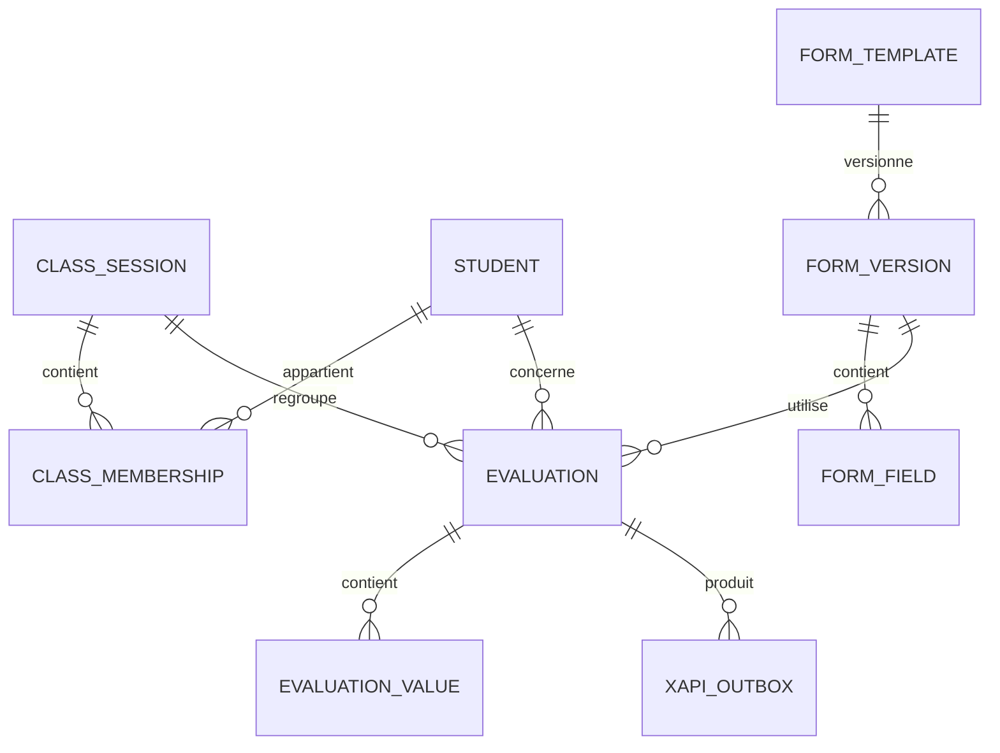

# 02 — Modèle de données local

## 1. Principes

La base SQLite locale est la source opérationnelle de vérité pendant le travail terrain.

Les identifiants techniques sont des UUID. Les données sont horodatées et les enregistrements importants disposent d'un numéro de version.

Les formulaires sont **versionnés** : une modification d'un formulaire ne doit jamais modifier rétroactivement une évaluation déjà réalisée.

## 2. Entités principales

### ClassSession

Représente une classe/session pédagogique.

Champs principaux :

- `id`
- `code` — ex. BAT MECAN 2026.1
- `level`
- `speciality`
- `label`
- `status`
- `createdAt`
- `updatedAt`

### Student

Représente un élève.

Champs principaux :

- `id`
- `externalId` — identifiant métier à définir
- `lastName`
- `firstName`
- `metadataJson` — données complémentaires strictement nécessaires

La quantité de données personnelles stockées doit être minimisée.

### ClassMembership

Association entre un élève et une session.

### FormTemplate

Décrit l'identité fonctionnelle d'un formulaire : sport, matelotage, manœuvre, etc.

### FormVersion

Version immuable d'un formulaire publiée pour utilisation.

Une nouvelle édition après publication crée une nouvelle version.

### FormField

Champ d'une version de formulaire.

Types initiaux :

- `text`
- `number`
- `timer`
- `checkbox`
- `score20`

Configuration générique :

- libellé ;
- aide ;
- obligatoire ou facultatif ;
- ordre ;
- unité ;
- minimum / maximum ;
- précision ;
- règles de validation ;
- paramètres spécifiques du chronomètre.

### Evaluation

Évaluation d'un élève dans une session avec une version précise de formulaire.

États proposés :

- `draft`
- `in_progress`
- `completed`
- `cancelled`

### EvaluationValue

Valeur d'un champ d'évaluation.

Le stockage doit conserver le type d'origine afin de ne pas perdre la précision :

- texte ;
- numérique ;
- booléen ;
- durée en millisecondes ;
- valeur JSON contrôlée pour extensions futures.

### XapiOutbox

File durable des statements à transmettre.

Champs principaux :

- `id`
- `statementId`
- `evaluationId`
- `payloadJson`
- `targetVersion`
- `status`
- `attemptCount`
- `lastAttemptAt`
- `lastError`
- `syncedAt`

### SyncLog

Journal technique local des synchronisations.

## 3. Schéma conceptuel

## 4. Versionnement des formulaires

Exemple :

- Formulaire « Natation 200 m » v1 utilisé le 20/09/2026.
- Le lendemain, le formateur ajoute « Apnée statique ».
- Le système crée v2.
- Les évaluations anciennes restent liées à v1.
- Les nouvelles évaluations utilisent v2.

Ce mécanisme garantit la traçabilité des résultats.

## 5. Chronomètre

Les durées sont conservées en **millisecondes entières** et non sous forme de texte.

L'affichage peut ensuite être calculé :

- 00:42.350 ;
- 02:10.000 ;
- etc.

Pour xAPI, la durée est convertie au format ISO 8601 lors de la génération du statement.

## 6. Sauvegarde et restauration

Une fonction d'export local doit être prévue pour générer un paquet SEAF chiffré contenant :

- la base ou un export contrôlé ;
- les métadonnées de version ;
- un contrôle d'intégrité.

La restauration doit vérifier la compatibilité de schéma avant import.

Cette fonction ne remplace pas la synchronisation xAPI : elle sert à la continuité opérationnelle et à la récupération locale.
